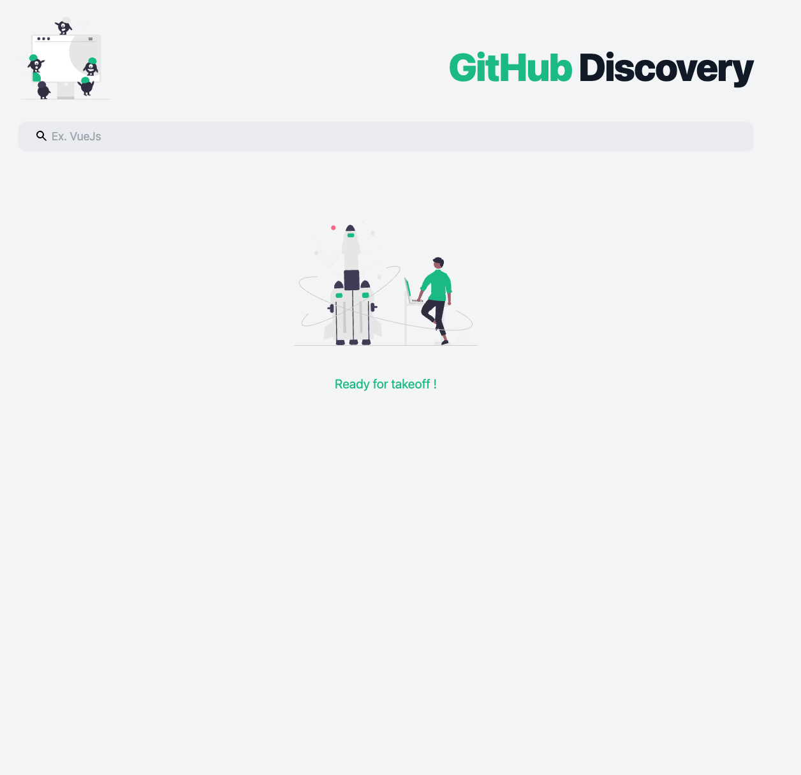
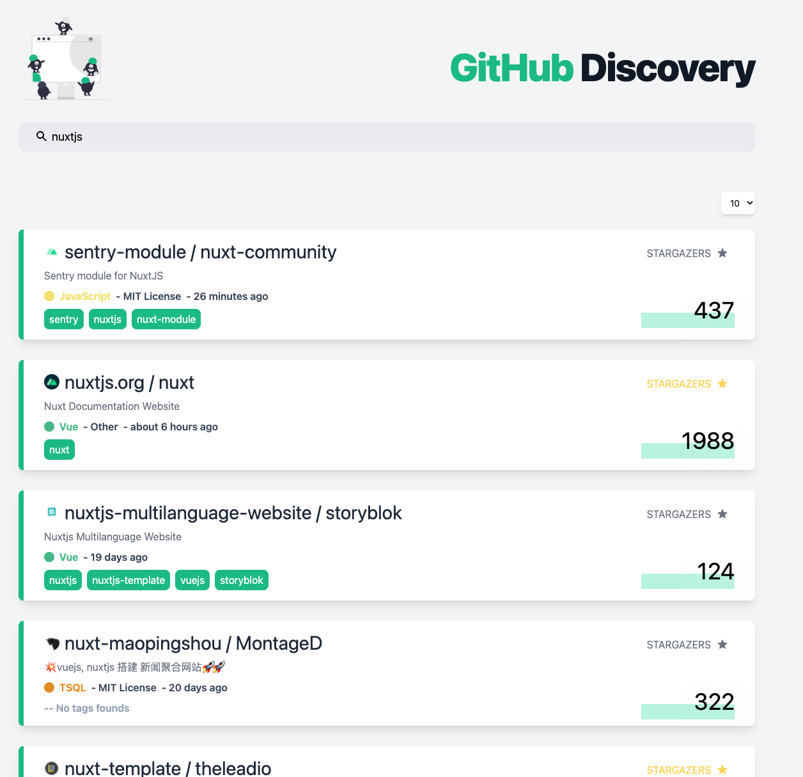

# GitHub Discovery

> Discover GitHub through GraphQL with Vue3 and ViteJs

<div align="center">
  
  
  
</div>

## Technologies used

- ⚡️ [ViteJs](https://github.com/vitejs/vite) with [Vue3](https://github.com/vuejs/vue-next)

- 🎨 [TailwindCss](https://tailwindcss.com/) and [Sass](https://sass-lang.com/)

- 🛣 [Vue-Router](https://next.router.vuejs.org/)

- 🚀 [Vue Apollo GraphQL](https://v4.apollo.vuejs.org/)

- 🔥 [Auto import components](https://github.com/antfu/unplugin-vue-components)

- 🎇 [Svg Loader](https://github.com/jpkleemans/vite-svg-loader)

- 🦾 [TypeScript](https://www.typescriptlang.org/)

## Table of Contents
- [Vue 3 + Typescript + Vite](#vue-3---typescript---vite)
  * [Recommended IDE Setup](#recommended-ide-setup)
    + [If Using `<script setup>`](#if-using---script-setup--)
  * [Type Support For `.vue` Imports in TS](#type-support-for--vue--imports-in-ts)
    + [If Using Volar](#if-using-volar)
    + [If Using Vetur](#if-using-vetur)
  * [Project setup](#project-setup)
    + [🤖 &nbsp;Create Github token](#----nbsp-create-github-token)
    + [⚙️ &nbsp;Setup environment variables](#----nbsp-setup-environment-variables)
    + [🖲 &nbsp;Commands line](#----nbsp-commands-line)
      - [Compiling and enabling hot-reloads for development](#compiling-and-enabling-hot-reloads-for-development)
      - [Lints and fixes files](#lints-and-fixes-files)
  * [Icons](#icons)
    + [Import icon in component](#import-icon-in-component)

# Vue 3 + Typescript + Vite

This template should help get you started developing with Vue 3 and Typescript in Vite.

## Recommended IDE Setup

[VSCode](https://code.visualstudio.com/) + [Vetur](https://marketplace.visualstudio.com/items?itemName=octref.vetur). Make sure to enable `vetur.experimental.templateInterpolationService` in settings!

### If Using `<script setup>`

[`<script setup>`](https://github.com/vuejs/rfcs/pull/227) is a feature that is currently in RFC stage. To get proper IDE support for the syntax, use [Volar](https://marketplace.visualstudio.com/items?itemName=johnsoncodehk.volar) instead of Vetur (and disable Vetur).

## Type Support For `.vue` Imports in TS

Since TypeScript cannot handle type information for `.vue` imports, they are shimmed to be a generic Vue component type by default. In most cases this is fine if you don't really care about component prop types outside of templates. However, if you wish to get actual prop types in `.vue` imports (for example to get props validation when using manual `h(...)` calls), you can use the following:

### If Using Volar

Run `Volar: Switch TS Plugin on/off` from VSCode command palette.

### If Using Vetur

1. Install and add `@vuedx/typescript-plugin-vue` to the [plugins section](https://www.typescriptlang.org/tsconfig#plugins) in `tsconfig.json`
2. Delete `src/shims-vue.d.ts` as it is no longer needed to provide module info to Typescript
3. Open `src/main.ts` in VSCode
4. Open the VSCode command palette
5. Search and run "Select TypeScript version" -> "Use workspace version"

## Project setup

```shell
$ npm run install
```

### 🤖 &nbsp;Create Github token

To communicate with the GraphQL server, you'll need an OAuth token with the right scopes.

Follow the steps in ["Creating a personal access token"](https://docs.github.com/en/authentication/keeping-your-account-and-data-secure/creating-a-personal-access-token) to create a token. The scopes you require depends on the type of data you're trying to request. For this project, you mainly need to have Repository scopes. For example, select the User scopes to request user data.

### ⚙️ &nbsp;Setup environment variables
**Before executing anything**, please create a `.env` file using the [env.d.ts](./src/types/env.d.ts) file as a schema (ask any front-end developer for the actual variable values).

### 🖲 &nbsp;Commands line
#### Compiling and enabling hot-reloads for development

```shell
$ npm run dev
```

#### Lints and fixes files

```shell
$ npm run lint
$ npm run lint:fix
$ npm run prettier:fix
```

## Icons

The project has been setup to support SVG icons.


### Import icon in component
SVG icons can be imported directly into a component :
```javascript
import IconTag from '@/assets/svg/tag.svg?component';
```